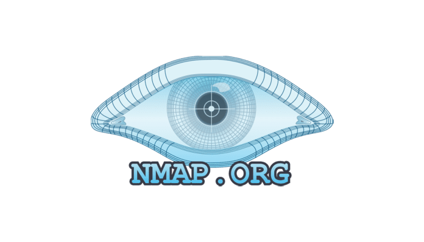
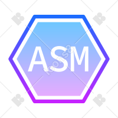

<h1 align="center">Hello there, I'm N0KK </h1>

  

I'm a 23-year-old Brazilian pentester, ethical hacker, and entrepreneur in cybersecurity. I'm a member of IDCiber, one of the largest cyber defense institutes in Latin America.

I love building pentesting tools using C, C++, Python, and Shell Script. I also have experience with HTML, CSS, JavaScript, and PHP, working with VueJS and Laravel. Additionally, I'm skilled in Cloud (AWS and Azure) and a Linux expert.

 
<h3 align="left">Languages and Tools:</h3>

   
   
   
   
   
   
   
  
  
  
  

<h3>My GitHub Stats</h3>

  

    

           
    
&nbsp;

              
    

  

  
  

    
  

          

<h3 align="left">Connect with me:</h3>

  
  
  

 

  
